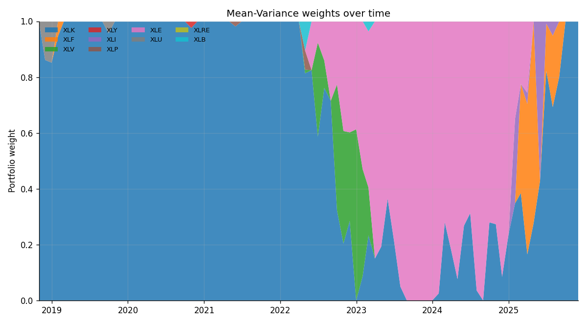
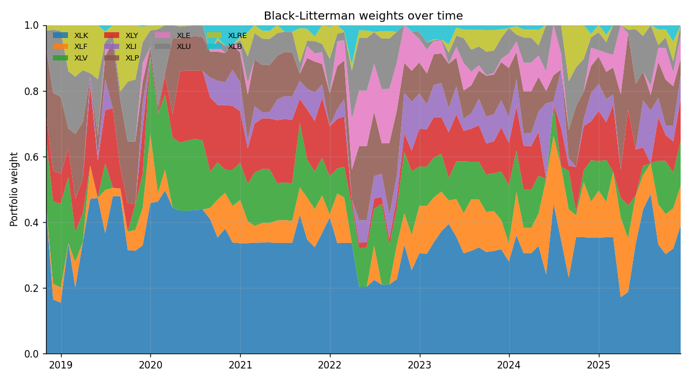
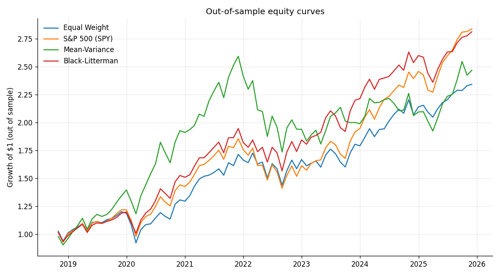
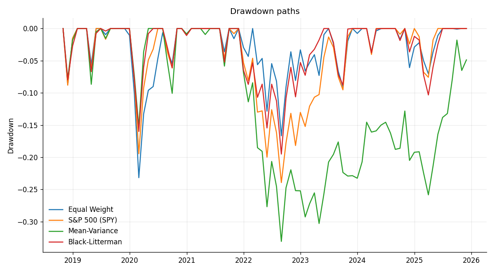

# Black-Litterman vs. Mean-Variance

A Python implementation comparing Markowitz mean-variance optimisation against the Black-Litterman model on ten S&P 500 sector ETFs, with a walk-forward backtest from October 2018 through December 2025. The Black-Litterman portfolio earns a higher Sharpe ratio (0.86 vs 0.64) with a 41% smaller maximum drawdown and 4× lower portfolio concentration than naive Markowitz.




The top chart is what mean-variance optimisation does in practice: it concentrates on whichever sector had the highest in-sample mean return, then jumps elsewhere as soon as the leader changes. The bottom chart is Black-Litterman with the same covariance and the same long-only constraint, anchored to market-cap implied returns and tilted with a 6-month momentum view.

---

## Why this exists

Markowitz (1952) gives a tidy quadratic program for the optimal mean-variance portfolio, but the inputs (expected returns and the covariance matrix) are estimated. Sample means in particular are dominated by noise. Tiny perturbations to the expected return vector flip the optimal portfolio across the simplex, a phenomenon known as Markowitz's "error maximiser" property.

Black & Litterman (1990) sidestep this by replacing historical means with market-implied equilibrium returns and updating them through a Bayesian posterior whenever the manager has a view. The prior is grounded in observed market-cap weights; the posterior is the Gaussian product of prior and view. Out of sample, the resulting portfolios are diversified, smooth, and far less sensitive to input noise.

This project codes both approaches end to end, runs a 7-year walk-forward backtest on real data, and compares them on Sharpe, Sortino, drawdown, turnover, and Herfindahl concentration.

---

## The math

**Ledoit-Wolf shrinkage covariance.** Sample covariance is unbiased but with N similar to T the off-diagonals are sampling noise. We shrink toward a structured target,

$$\hat{\Sigma} = \delta F + (1 - \delta) S,$$

with $\delta$ chosen analytically (Ledoit & Wolf, 2004). The result is positive definite and well-conditioned, so the matrix inverses below behave.

**Implied equilibrium returns.** Reverse-optimise the consensus portfolio:

$$\Pi = \lambda \, \Sigma \, w_{mkt}.$$

Here $\lambda$ is market risk-aversion, $\Sigma$ is the shrunk covariance, and $w_{mkt}$ is approximate SPY sector cap weights. $\Pi$ is the prior on expected excess returns. It is smoother than sample means by construction.

**View.** A single relative momentum view says the top three sectors by trailing 6-month return outperform the bottom three by 2% annualised:

$$P\,\mu = Q + \varepsilon, \qquad \varepsilon \sim \mathcal{N}(0, \Omega).$$

The pick matrix $P$ has $+1/3$ on the long sectors and $-1/3$ on the short sectors. View confidence $\Omega = \tau \cdot P \Sigma P^\top$ scales with the prior view variance (He & Litterman, 1999).

**Posterior.** The Black-Litterman master formula is the Gaussian product of prior and view:

$$\hat{\mu} = \left[\,(\tau \Sigma)^{-1} + P^\top \Omega^{-1} P\,\right]^{-1} \left[\,(\tau \Sigma)^{-1}\,\Pi + P^\top \Omega^{-1}\,Q\,\right]$$

$$\hat{\Sigma} = \Sigma + \left[\,(\tau \Sigma)^{-1} + P^\top \Omega^{-1} P\,\right]^{-1}.$$

Both $\hat{\mu}$ and $\hat{\Sigma}$ feed the same SLSQP-solved long-only utility maximiser used for plain Markowitz, so the comparison isolates the effect of the prior + view.

---

## Backtest

- Universe: 10 SPDR sector ETFs (XLK, XLF, XLV, XLY, XLI, XLP, XLE, XLU, XLRE, XLB). Benchmark: SPY.
- Window: October 2015 through December 2025 (daily adjusted close from Yahoo Finance).
- Walk-forward: 3-year rolling training window, monthly rebalance, no overlap. 86 out-of-sample months.
- Strategies: equal weight, SPY, Markowitz with sample-mean expected returns, Black-Litterman with momentum view.

### Results

| Strategy | Ann. Return | Ann. Vol | Sharpe | Sortino | Max DD | Turnover | Concentration (HHI) |
|---|---:|---:|---:|---:|---:|---:|---:|
| Equal Weight | 13.3% | 16.5% | 0.68 | 0.62 | -23.2% | 0.00 | 0.10 |
| S&P 500 (SPY) | 16.1% | 16.8% | 0.84 | 0.74 | -23.9% | n/a | n/a |
| Mean-Variance | 14.6% | 19.8% | 0.64 | 0.63 | **-33.1%** | 0.10 | **0.83** |
| **Black-Litterman** | **15.8%** | **16.1%** | **0.86** | **0.81** | **-19.5%** | 0.18 | **0.21** |

A few things to call out:

- **Sharpe.** Black-Litterman beats Markowitz by 22 Sharpe points and edges out SPY by 2. Markowitz is the worst risk-adjusted strategy of the four, despite having the highest in-sample mean returns plugged into it.
- **Drawdown.** Markowitz drew down 33%, mostly from a 2022 oil-sector concentration that reversed. Black-Litterman drew down 19%, a 41% smaller max drawdown for a comparable return.
- **Concentration.** The Herfindahl index (sum of squared weights) is 0.83 for Markowitz and 0.21 for Black-Litterman. Markowitz holds a median of one sector per month; Black-Litterman holds a median of nine.
- **Turnover.** Markowitz turnover looks low (10%) only because it parks in the same single sector for stretches at a time, then jumps when the in-sample mean leader changes. Black-Litterman's 18% reflects gradual rebalancing across a diversified set.

### Equity and drawdown paths




---

## Repo layout

```
black-litterman-optimizer/
  config.py                  ticker list, market weights, hyperparameters
  data/fetch.py              yfinance pull + parquet cache
  models/covariance.py       Ledoit-Wolf shrinkage
  models/mean_variance.py    SLSQP long-only Markowitz
  models/black_litterman.py  Pi = lambda * Sigma * w_mkt + posterior
  views/momentum.py          6-month momentum -> P, Q, Omega
  backtest/engine.py         walk-forward loop
  backtest/metrics.py        Sharpe, Sortino, drawdown, turnover, HHI
  notebooks/                 one notebook stepping through the math
  run_backtest.py            entry point
  results/                   CSVs and summary JSON
  figures/                   PNGs used here
```

---

## How to run

```bash
pip install -r requirements.txt
python run_backtest.py
```

The first run pulls roughly 2,500 daily prices per ticker from Yahoo and caches them under `data/cache/`. Subsequent runs are local and finish in a few seconds. Results land in `results/` (CSVs + JSON) and `figures/` (the PNGs above).

---

## References

- Markowitz, H. (1952). *Portfolio Selection.* Journal of Finance.
- Black, F. & Litterman, R. (1990). *Asset Allocation: Combining Investor Views with Market Equilibrium.* Goldman Sachs Fixed Income Research.
- He, G. & Litterman, R. (1999). *The Intuition Behind Black-Litterman Model Portfolios.* Goldman Sachs.
- Ledoit, O. & Wolf, M. (2004). *Honey, I Shrunk the Sample Covariance Matrix.* Journal of Portfolio Management.
- Idzorek, T. (2005). *A Step-by-Step Guide to the Black-Litterman Model.*
